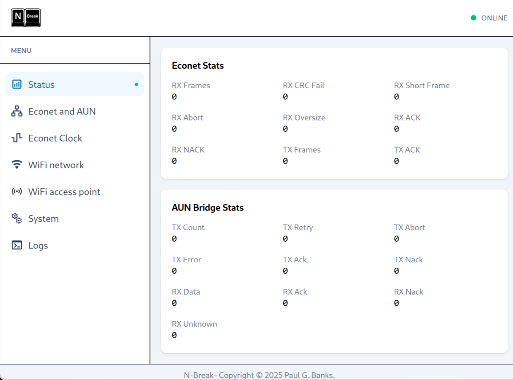

# N-Break — Econet-over-WiFi (AUN) Gateway

## Overview

N-Break is an Econet-over-WiFi interface that allows a retro BBC Micro to
communicate with an AUN fileserver (or other device) over a modern IP network.

It recreates the classic Econet experience using inexpensive, readily
available hardware - no custom PCBs or extensive soldering required.

## Hardware Requirements

To build the interface, you will need:

- **1 × ESP32-C6 module**
  Example: <a href="https://it.aliexpress.com/item/1005007399157637.html" target="_blank" rel="noopener noreferrer">https://it.aliexpress.com/item/1005007399157637.html</a>
  Approx. price: €5.39

- **2 × RS422/RS485 transceiver modules**
  Example: <a href="https://it.aliexpress.com/item/32688467460.html" target="_blank" rel="noopener noreferrer">https://it.aliexpress.com/item/32688467460.html</a>
  Approx. price: €1.69 each

- **1 × 5-pin DIN plug** and twisted-pair cable (e.g., CAT5)

- **Jumper/Dupont wires** to connect everything

- **3 resistors** for Econet termination and biasing:
  - 1 × **110 Ω** termination
  - 2 × **550 Ω** idle bias

## Hardware Assembly

Connect the components as shown in the schematic:


**Note:** Power the RS485 driver modules from **3.3 V**.

Final assembly complete with Econet plug ready for use:


## Upload the firmware to your ESP32

Connect your ESP32 via USB (left socket) and identify the serial
port your computer assigned it.

Download the release zip you want to install from the releases on this page.

esptool running in Python 3 is used to upload the firmware. Adjust
these steps for your envrionment as nescessary.

```shell
# Create an empty directory for hosting esptool
mkdir nbreak-tmp
cd nbreak-tmp

# Create virtual environment and install esptool inside of it
python -mvenv venv --prompt nbreak-flash
source venv/bin/activate
pip install esptool

# Unzip the firmware release bundle
unzip /path/to/nbreak-firmware-xxx.zip
cd dist/

# Flash it - NOTE: CHANGE /dev/ttyXXX to the serial port your ESP32 is on!
python -m esptool --port /dev/ttyXXX --chip esp32c6 -b 460800 --before default_reset --after hard_reset write_flash "@flash_args"

# Clean up
deactivate
cd ../../
rm -rf nbreak-tmp
```

## Device Configuration and monitoring

After flashing, the device will start a Wi-Fi access point named nbreak-econet.

1. Connect to the access point.

2. Open a browser and go to http://192.168.4.1. You can select the menu items on the left.



3. After connecting WiFi and verifying you have access, you can configure the Econet/AUN settings.

The example screenshot below is for a BBC Micro whose station ID is 127 and a fileserver at 192.168.0.1.


The first table, the Econet Stations list, should specify the station numbers on your Econet that you intend to expose to the IP network. N-Break will monitor the designated port for traffic addressed to these stations. Currently you can have a maximum of 5. Additional entries
will not be loaded.

The second table defines the AUN IP hosts that you want to present to the Econet network. N-Break will listen on the Econet for these station IDs and respond on their behalf, forwarding the traffic to the specified IP address and port.

For communications to be successful, you need at least one entry in both tables.

## AUN Fileserver Setup

A couple of AUN Fileservers have been tested. The best so far is the
one included with PiEconetBridge. Despite the name, you can run the
fileserver easily without needing either a Raspberry Pi or the Econet
bridge hardware and it's very good.

An honorable mention goes to aund. This was what I developed the
original code against. It was what first sent the Pacman2 binary to
my real-life BBC over Econet bringing it to life with lights and
sound. Alas it has some bugs which made me look for alternatives.

Example configuration files for both are included in the contrib/ directory under peb and aund respectively.

## Building the firmware yourself

Firmware is built and flashed using **idf.py** from **version 5.5.1** of the ESP-IDF toolchain.

Please note the ESP-IDF version number specified above. It is required because in order to reduce
latency, we access internal private data of the PARLIO driver to give us better control of the
DMA scheduling, FIFO loading and start/stop control of the peripheral.

1. Install ESP-IDF:
   <a href="https://docs.espressif.com/projects/esp-idf/en/stable/esp32/get-started/index.html" target="_blank" rel="noopener noreferrer">https://docs.espressif.com/projects/esp-idf/en/stable/esp32/get-started/index.html</a>

2. Build and flash the firmware:

   ```shell
   idf.py flash
   ```

## Enjoy!
