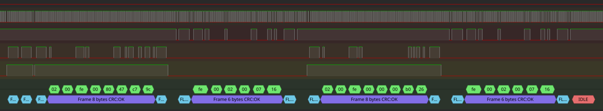

# Econet Sigrok Decoder

Author: Paul G. Banks <https://paulbanks.org/projects/econet>

To install, copy the econet directory (including the directory) to ~/.local/share/libsigrokdecode/decoders (or wherever the decoders live on your platform)

## Use

Then start PulseView. You should see Econet in the list of Decoders.

If your logic analyser is connected to the bus you can select the clock
and data to get a full decode.

If you're connected instead to a half duplex driver where the TX and RX
signals are separate signals (such as on NBreak) you can select RX as 
the DATA and TX as the DATA2 with the output enable as DATA2EN.

